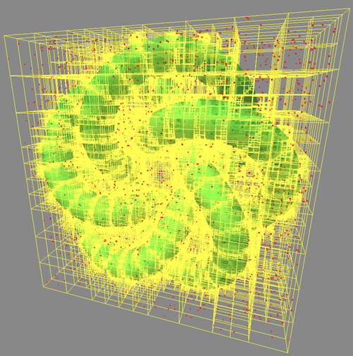

# three-octree-vertices
Octree of vertices for three.js

[](https://www.npmjs.com/package/three-octree-vertices)

Octree is a space partitioning tree data structure in which each internal node has exactly eight children, used for O(logn) spatial queries.
For information on Octree from [wikipedia](https://en.wikipedia.org/wiki/Octree).

## Demo
Show the octree of a mesh and adds a few more points every second.
https://erasta.github.io/three-octree-vertices/index.html  


## Install
```sh
npm install --save three-octree-vertices
```

## Usage
```js
import { Octree } from 'three-octree-vertices';
const octree = new Octree(mesh.geometry);
const found = octree.search(new THREE.Sphere(point, radius));
```

#### `octree = new Octree(vertices, maxVerticesPerNode)`
Builds an Octree from the vertices.  
vertices - (array-like of Vector3 | BufferGeometry) points to build the tree from.
maxVerticesPerNode - (Integer) threshold for splitting a tree node into 8 sub-trees.

#### `octree.addVertex(vertex)`
Adding a vertex (Vector3) to the tree

#### `foundIndices = octree.search(sphere)`
Searches for vertices inside the sphere and returns their indices (array of Integer)
